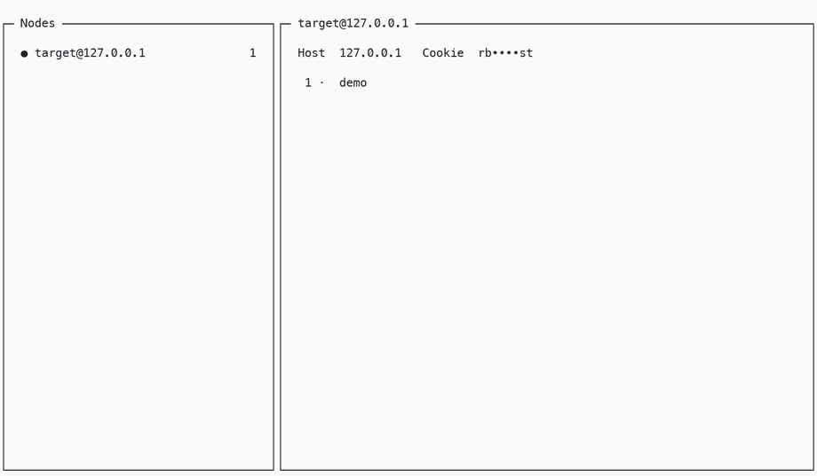

# redbug-cli

A terminal UI for tracing remote Erlang and Elixir nodes with
[redbug](https://hex.pm/packages/redbug), without adding code, installing an agent, or deploying
anything to the target node.

[](LICENSE)

## Demo

<!--
Add the demo GIF here before publishing, for example:


-->

_Demo GIF coming soon._

## Why redbug-cli?

- Trace live function calls, returns, sends, and receives from a terminal UI.
- Connect to local nodes, routable remote nodes, or SSH-only hosts.
- Tunnel into containerized releases automatically when SSH details are configured.
- Keep trace sessions, reusable trace patterns, snippets, and node config on the controller.
- Inspect event payloads and stack traces in the TUI or open them in `$EDITOR`.

The target only needs to be reachable over Erlang distribution with a matching cookie. The
controller and TUI run locally.

## Quick Start

Tool versions are pinned in [mise.toml](mise.toml):

```sh
mise install
mise run dev
```

This starts the controller on a random local port and opens the TUI.

In another terminal, start a throwaway target node with the same cookie:

```sh
iex --name target@127.0.0.1 --cookie rbtest
```

Define and call something in that `iex` session:

```elixir
defmodule Demo do
  def add(a, b), do: a + b
end

Demo.add(1, 2)
```

In redbug-cli:

1. Press `n` and add node `target@127.0.0.1` with cookie `rbtest`.
2. Press `c` to connect.
3. Press `s` to create a session.
4. Open the session, press `t`, add `Demo.add/2 -> return`, and enable it.
5. Press `space` to start tracing.
6. Call `Demo.add(1, 2)` again in `iex`.

You should see the call and return events stream into the session.

## Install / Package

Build the single-file executable:

```sh
mise run package
./dist/redbug
```

The packaged binary embeds the Elixir controller release and the Bun TUI launcher. On first run it
extracts the controller to a per-build cache directory, starts it locally, and tears it down when
the TUI exits.

Current packaging target: macOS arm64.

## Tracing Remote Nodes

redbug-cli supports three remote-node paths:

| Target shape | Use |
|---|---|
| SSH-only host with a Docker/Kamal container | Built-in SSH tunnel |
| Routable host over VPN/LAN/WireGuard | Direct Erlang distribution |
| CI or custom tunnel setup | `REDBUG_NODES` |

For details, see [Remote nodes](docs/remote-nodes.md).

## Running Pieces Separately

Pin the port with `REDBUG_PORT` when starting the controller and TUI yourself:

```sh
cd server
REDBUG_PORT=4010 elixir --name redbug_controller@127.0.0.1 --cookie rbtest -S mix phx.server

cd ../tui
REDBUG_HOST=127.0.0.1 REDBUG_PORT=4010 bun run dev
```

## Configuration

Config is persisted to `~/.config/redbug/config.json` and honors `$XDG_CONFIG_HOME`. The file
stores nodes, sessions, presets, snippets, and settings. Cookies are stored in plaintext, so keep
the config local and private.

| Variable | Component | Default | Purpose |
|---|---|---|---|
| `REDBUG_HOST` | TUI | `127.0.0.1` | Controller host |
| `REDBUG_PORT` | TUI / server | random when unset | WebSocket port |
| `REDBUG_PORT_FILE` | server | - | Writes the chosen port for launchers |
| `REDBUG_NODES` | server | - | Env-injected nodes: `name@host\|dial_ip:port\|cookie` |
| `RB_COOKIE` | dev | `rbtest` | Cookie used by `mise run dev` |
| `CONTROLLER_NODE` | server | `redbug_controller@127.0.0.1` | Controller node name |
| `CONTROLLER_DISTRIBUTION` | server | `name` | Use `sname` for shortname targets |
| `XDG_CONFIG_HOME` | server | `~/.config` | Config base directory |

## Keybindings

Press `?` in the TUI for the active screen's keymap.

Common keys:

| Screen | Keys |
|---|---|
| Tree | `j/k` move, `enter` open, `n` node, `s` session, `e` edit, `c` connect, `d` delete |
| Events | `enter` detail, `v` open event in `$EDITOR`, `z` zoom, `/` filter, `t` traces |
| Trace session | `space` start/restart, `x` stop, `Ctrl+S` apply/restart, `Ctrl+L` clear |
| Console | `n` new, `e` edit+run, `r` run, `v` view, `s` save snippet, `x` stop, `Ctrl+L` clear |

## Development

```sh
cd server && mix test
pnpm --dir tui typecheck
```

The full session-root test drives the store layer against a real target node, so start a target
like the quick-start `iex` node first when running the whole server test suite.

## Architecture

redbug-cli has two parts:

- **Controller**: an Elixir [musubi](https://hex.pm/packages/musubi) app with
  server-authoritative state over a Phoenix WebSocket. It owns config, connects to target nodes,
  and runs redbug.
- **TUI**: an [opentui](https://opentui.com) / React client on Bun.

The domain model is:

```text
Node -> Session -> Trace patterns -> Events
```

## Security

- The Erlang distribution cookie is remote-code-execution capability on the target.
- Keep the WebSocket bound to `127.0.0.1`.
- Erlang distribution is unencrypted unless tunnelled; use SSH or a trusted private network.
- Do not expose epmd or distribution ports to untrusted networks.

## Documentation

- [Architecture](docs/ARCHITECTURE.md)
- [Remote nodes](docs/remote-nodes.md)
- [Testing & screenshots](docs/testing.md)
- [Demo script](docs/demo-script.md)

## License

[MIT](LICENSE) © Phil Chen
